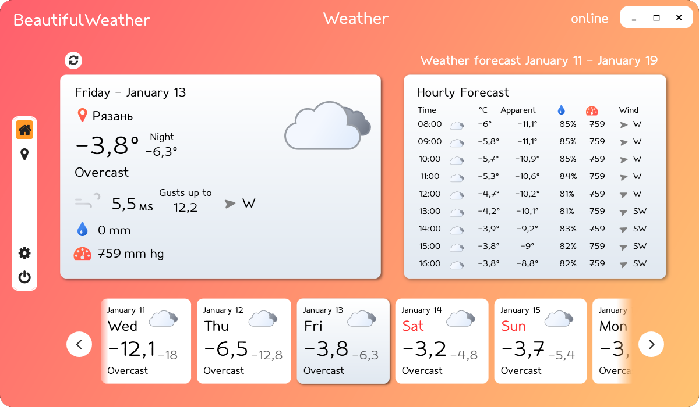
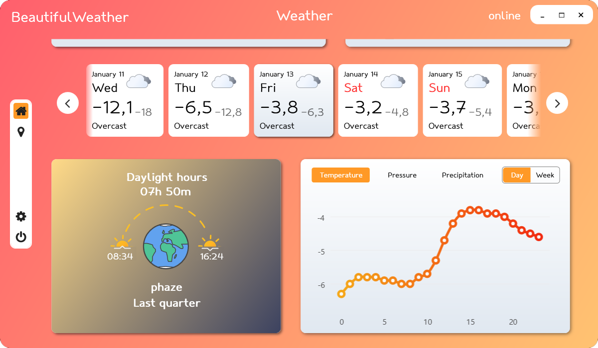
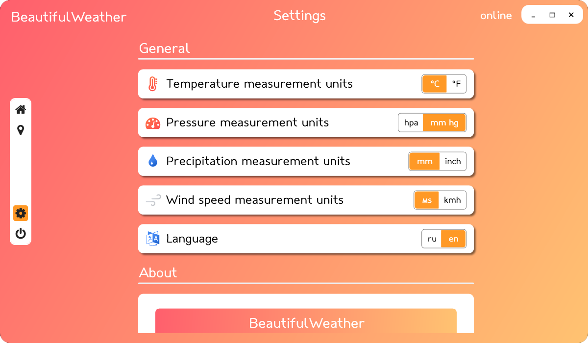
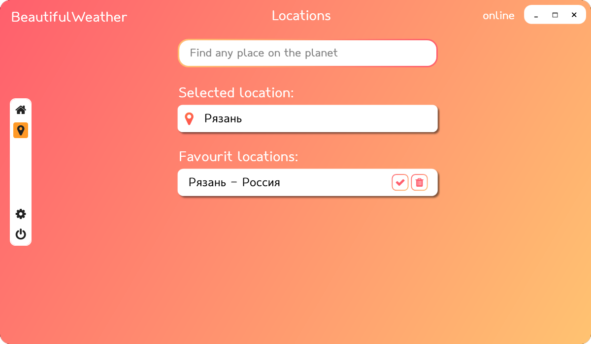

# Beautiful Weather
### WPF приложение для прогноза погоды

WeatherApp в удобной и красивой форме предоставляет метеоданные сайта [Open-Meteo](https://open-meteo.com/)

### Особенности
- Полный набор метеоданных
- Прогноз на 10 дней, доступен почасовой прогноз
- График температуры, давления, влажности
- Прогноз в указанном месте по адресу - использован геокодер
- Удобное переключение между местоположениями
- Анимированные иконки погоды
- Красивый дизайн в стиле flat ui
- Поддержка двух языков (английский и русский), динамическое переключение
- Несколько единиц измерений для температуры, давления, скорости ветра, количества осадков

### Скриншоты

</img>

### Благодарности

- Шрифт [Klukva](https://www.behance.net/gallery/145290893/shrift-kljukva)
- Дизайн анимированных иконок [Meteocons](https://github.com/basmilius/weather-icons) (Svg иконки руками переписаны на xaml)
- Метеоданные [Open-Meteo](https://open-meteo.com/)
- Геокодер [Yandex](https://yandex.ru/dev/maps/geocoder/)
